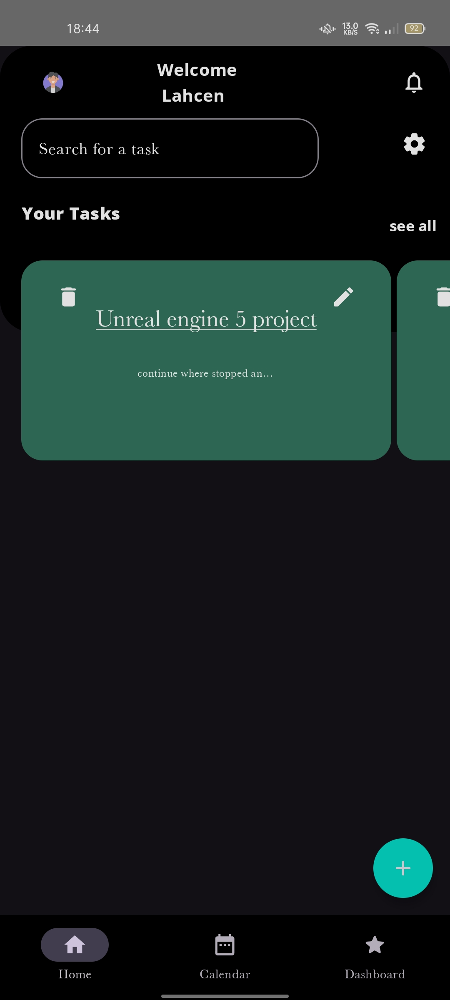

a pop up window for every task of the list, when the user click on a task it open up the window shows up details about the task

a screen mentioning all the tasks in lazyColumn when click on "see all"

a modify screen to modify the task when the user click on the pen icon on the task
